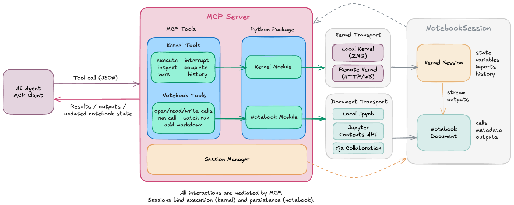

# Agent Jupyter Toolkit

[](https://github.com/Cyb3rWard0g/agent-jupyter-toolkit/actions/workflows/ci.yml)
[](https://github.com/Cyb3rWard0g/agent-jupyter-toolkit/releases)
[](LICENSE)
[](https://www.python.org/)



An open-source project to provide the right tools for AI agents to execute
code through Jupyter kernels, whether local or remote, and optionally attach
a notebook document for persistent, reproducible workflows. At its core, the
project offers a Python library with async kernel sessions, notebook document
transports, variable management, and dependency tracking so any agent
framework can integrate directly. To align with the community's adoption of
Model Context Protocol (MCP), the project also ships an MCP server that exposes
these same capabilities as a standardized tool suite, including optional
PostgreSQL tools for data workflows.

## Packages

| Package | PyPI | Description |
|---------|------|-------------|
| [**agent-jupyter-toolkit**](packages/agent-jupyter-toolkit/) | [](https://pypi.org/project/agent-jupyter-toolkit/) [](https://pypi.org/project/agent-jupyter-toolkit/) | Async kernel sessions (local/remote/attach), code execution, notebook transports, cell editing, package management, dependency tracking, variable inspection, and MIME serialization |
| [**mcp-jupyter-notebook**](packages/mcp-jupyter-notebook/) | [](https://pypi.org/project/mcp-jupyter-notebook/) [](https://pypi.org/project/mcp-jupyter-notebook/) | MCP server — exposes the toolkit as standardized tools for AI agents, plus additional data tools to connect to databases (e.g. PostgreSQL) |

## Quick Start

```sh
# Install just the toolkit
pip install agent-jupyter-toolkit

# Install toolkit + DataFrame serialization support
pip install agent-jupyter-toolkit[dataframe]

# Or install the MCP server (includes the toolkit as a dependency)
pip install mcp-jupyter-notebook

# MCP server + toolkit DataFrame serialization support
pip install mcp-jupyter-notebook[dataframe]
```

### Toolkit — run code in a Jupyter kernel

```python
import asyncio
from agent_jupyter_toolkit.kernel import SessionConfig, create_session

async def main():
    async with create_session(SessionConfig(mode="local", kernel_name="python3")) as session:
        result = await session.execute("print('Hello from Jupyter!')")
        print(result.stdout)

asyncio.run(main())
```

### MCP Server — expose Jupyter to AI agents

```bash
# stdio transport (for VS Code, Cursor, Claude Desktop)
mcp-jupyter-notebook --mode local --kernel-name python3

# Connect to a remote Jupyter server
mcp-jupyter-notebook --mode server --base-url http://localhost:8888 --token my-token
```

### Enable PostgreSQL tools

The server ships with optional PostgreSQL tools (schema exploration, query→DataFrame).
Enable them with an env var or CLI flag:

```bash
# Env var
export MCP_JUPYTER_ENABLE_TOOLS=postgresql
mcp-jupyter-notebook --mode server --base-url http://localhost:8888 --token my-token

# Or CLI flag
mcp-jupyter-notebook --mode server --enable-tools postgresql ...
```

The kernel reads the database DSN from `PG_DSN`, `POSTGRES_DSN`, or `DATABASE_URL`
(in that order). In server mode these must be set in the **Jupyter server environment**
so kernels inherit them.

A Docker Compose quickstart with Postgres is available:

```bash
cd packages/mcp-jupyter-notebook/quickstarts
docker compose --profile postgres up -d
# Jupyter at http://localhost:8888 (token: mcp-dev-token)
# Postgres seeded with a demo_users table
```

## Development

```sh
git clone https://github.com/Cyb3rWard0g/agent-jupyter-toolkit.git
cd agent-jupyter-toolkit
uv sync --all-packages    # installs both packages + dev deps into .venv
```

```sh
# Run all tests
uv run --all-packages pytest

# Lint & format
uv run ruff check packages/ --fix
uv run ruff format packages/
```

## Repository Layout

```
├── packages/
│   ├── agent-jupyter-toolkit/    # Domain library
│   │   ├── src/agent_jupyter_toolkit/
│   │   ├── tests/
│   │   └── quickstarts/
│   └── mcp-jupyter-notebook/     # MCP server
│       ├── src/mcp_jupyter_notebook/
│       ├── tests/
│       └── quickstarts/
├── docs/                         # Centralized documentation
│   ├── toolkit/                  # Kernel sessions, transports, utilities, config
│   └── mcp-server/              # Architecture, configuration, tools reference
├── CONTRIBUTING.md               # Dev setup, testing, release process
└── pyproject.toml                # Workspace root (uv workspace config)
```

## Documentation

| Document | Description |
|----------|-------------|
| [Getting Started](docs/getting-started.md) | Installation, first kernel session, first notebook edit |
| [Architecture](docs/architecture.md) | Monorepo layout, transport pattern, design decisions |
| [Toolkit Docs](docs/toolkit/) | Kernel sessions, notebook transports, utilities, configuration, API reference |
| [MCP Server Docs](docs/mcp-server/) | Server architecture, configuration, notebook + PostgreSQL tools |
| [Contributing](CONTRIBUTING.md) | Dev setup, testing, linting, release process |

## License

[Apache License 2.0](LICENSE)
